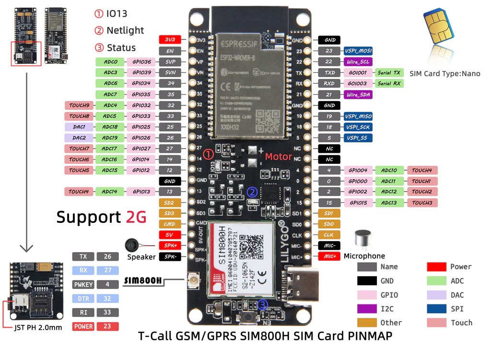

# Documentation Lilygo ESP32
- [LILYGO Shop Site mit Pinout Referenz](https://lilygo.cc/products/t-call-v1-4)

- User_Setup.h muss nach pio libdeps TFT_eSPI kopiert werden

- ADC wird gebraucht:
[ADS1115 Tutorial](https://learn.adafruit.com/adafruit-4-channel-adc-breakouts/arduino-code#construction-and-initialization-4-2)

- GPIO Expansion wird gebraucht [Shop]()