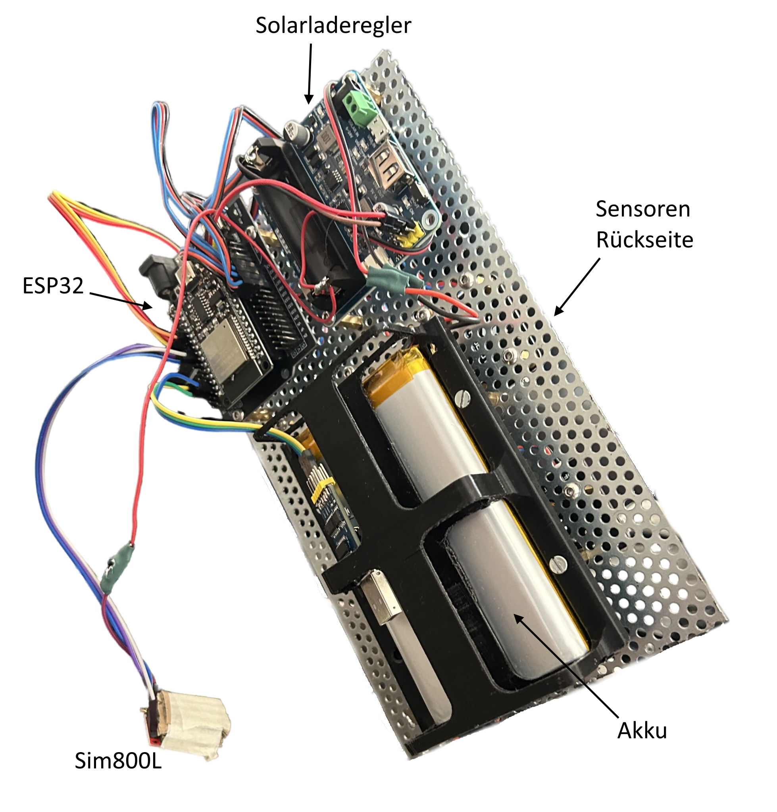
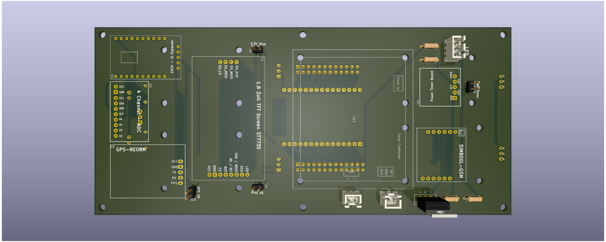
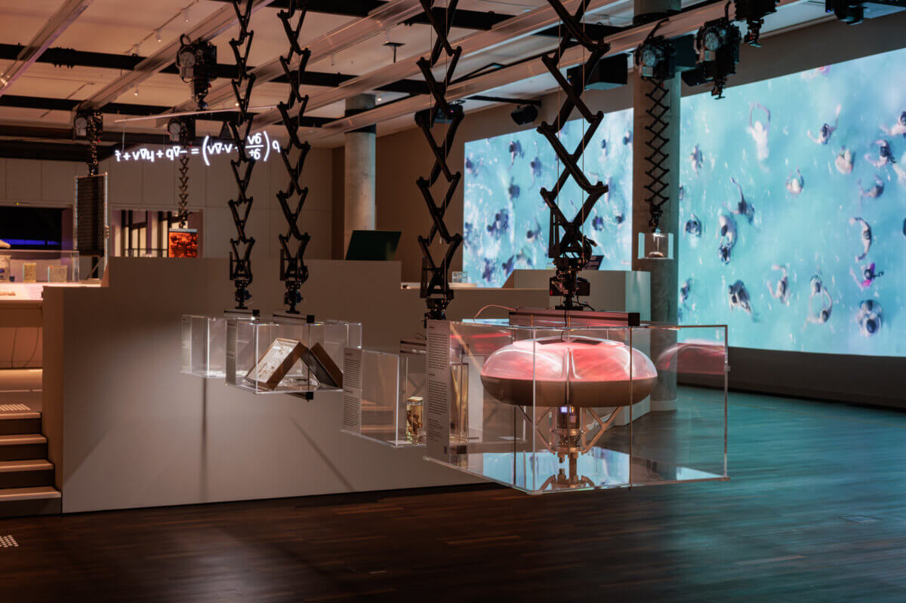

# Datenbojen
In diesem Projekt wird die Umsetzung einer autonomen Datenerfassungsplattform dokumentiert.

## Bachelorarbeit
Genaueres zu dem Projekt kann in der Bachelorarbeit von Alexander Mohr nachgelesen werden.
[Bachelorarbeit](docs/Datenbojen_Bachelor_Arbeit.pdf)

## Ausstellung
Ein Prototyp des Projekts wurde im Berliner Humboldt Forum ausgestellt.

## Rückfragen
- Email an a.mohr@campus.tu-berlin.de