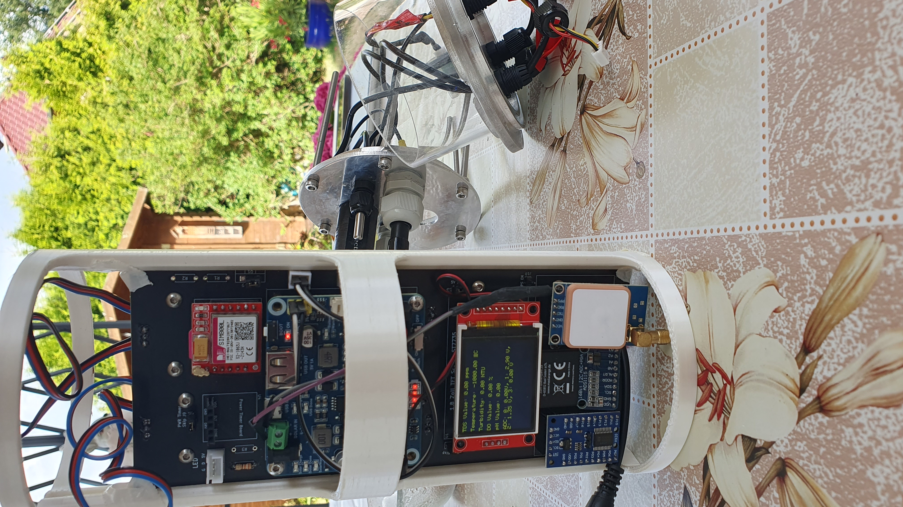
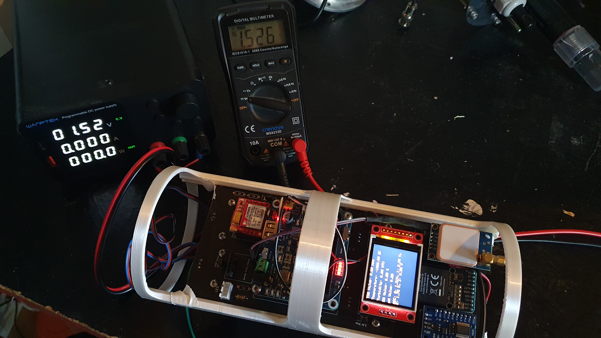
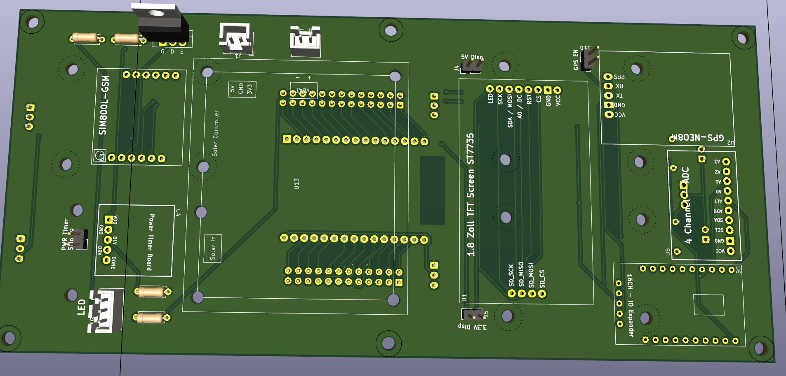
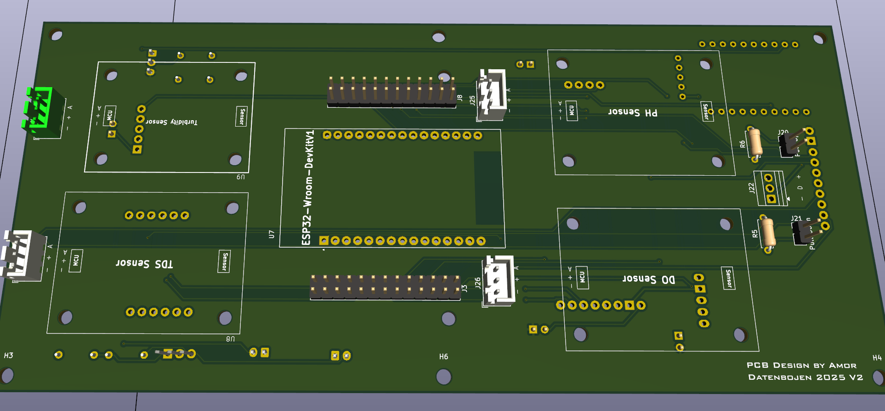

# Projekt Datenboje
Open Source - Messplattform für Datenerhebung in Remote - Areas

## Features
- Solar Input 6-24V 
    - Waveshare Solar Module
- 10Ah Li-Po Battery
- ESP32
- x - GPIO
- ADC
    - ADS1115 - 4Channel - 24bit
- 

## PCB - Design

---

# Readme

Datenbojen Bachelor Git Token:
olp_1oo37QpfbeHbzyl6HBGaz0pBIDkBmW41RVnO
